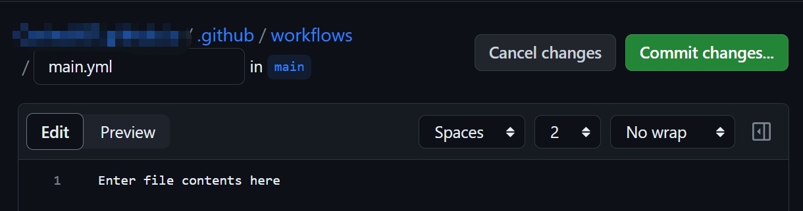

## Push to the branch on another repo on github

### New workflows

You can choice a workflows, also there are many templates to choose from, or you can set up a yourself workflows.

some demos:




### Github actions ssh deploy key

`GitHub Actions` 是 GitHub 提供的自动化构建、测试和部署工具，它可以帮助开发者在代码提交后自动进行测试和部署。
如果需要在 `GitHub Actions` 中使用 `SSH` 部署密钥，可以按照以下步骤进行设置：

[生成 SSH 密钥](https://docs.github.com/zh/authentication/connecting-to-github-with-ssh/generating-a-new-ssh-key-and-adding-it-to-the-ssh-agent)：在本地计算机上使用 ssh-keygen 命令生成 SSH 密钥对，公钥（id_ed22519.pub）和私钥（id_ed22519）。注意，私钥不应该被泄露，公钥需要被添加到目标服务器的 [Deploy keys](https://github.com/your_username/your_repo/settings/keys) 文件中。

```sh
$ ssh-keygen -t ed25519 -C "your_email@example.com"
```

添加 SSH 密钥到仓库 [Secrets](https://github.com/your_username/your_repo/settings/secrets/actions)：在 GitHub 仓库的 Settings 页面中，点击左侧导航栏的 Secrets，创建一个名为 DEPLOY_PRIVATE_KEY 的 Secret，并将私钥的内容复制到 Value 字段中。

配置 GitHub Actions：在 GitHub Actions 的工作流文件中，使用 actions/setup-ssh Action 将 SSH 密钥添加到工作环境中。例如，以下是一个使用 SSH 密钥部署的示例：

```yml
name: Build & Deploy
on:
  push:
    branches: [main]

jobs:
  deploy:
    name: Deploy to Github Pages
    runs-on: ubuntu-latest
    steps:
      - uses: actions/checkout@v3

      - name: Setup Node.js
        uses: NullVoxPopuli/action-setup-pnpm@v2.3.0
        with:
          no-lockfile: true

      - name: pnpm install, build
        run: |
          pnpm install
          pnpm run build

      # demo
      - name: Deploy
        uses: easingthemes/ssh-deploy@v2.2.1
        env:
          SSH_PRIVATE_KEY: ${{ secrets.DEPLOY_PRIVATE_KEY }}
          ARGS: -rltgoDzvO --delete
        with:
          server: user@server.com
          port: 22
          source: path/to/local/files
          dest: /path/to/remote/files

      - name: Deploy to another repository
        uses: s0/git-publish-subdir-action@develop
        env:
          REPO: git@github.com:Carina957/Carina957.github.io.git
          BRANCH: main
          FOLDER: docs/.vitepress/dist
          SSH_PRIVATE_KEY: ${{secrets.DEPLOY_PRIVATE_KEY}}
```

### Other recommended repo

- [push-git-subdirectory-as-branch](https://github.com/marketplace/actions/push-git-subdirectory-as-branch)
- [push-a-file-to-another-repository](https://github.com/marketplace/actions/push-a-file-to-another-repository)
- [github-action-push-to-another-repository](https://github.com/cpina/github-action-push-to-another-repository)
