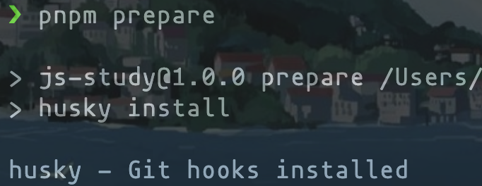
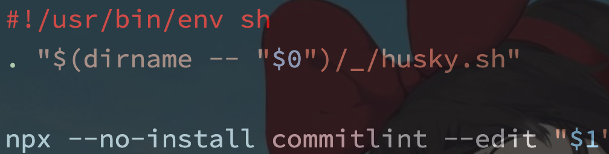
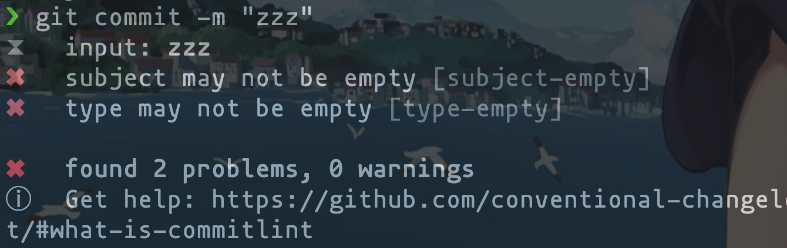

# 提交规范

## 各种类型的规范

- feat: A new feature(新增 `feature`)
- fix: A bug fix(修复 bug)
- docs: Documentation only changes(仅文档更改,如 `README.md`)
- refactor: A code change that neither fixes a bug nor adds a feature(代码重构，没有新增功能或修复 bug)
- perf: A code change that improves performance(优化相关，如提升性能、用户体验等)
- test: Adding missing tests or correcting existing tests(测试用例，包括单元测试、集成测试)
- build: Changes that affect the build system or external dependencies (example scopes: gulp, broccoli, npm)(影响构建系统或外部依赖关系的更改（示例范围：gulp、broccoli、npm）)
- chore: Other changes that don't modify src or test files(其他不修改 src 或测试文件的更改)
- improvement: An improvement to a current feature(对当前特性的改进)
- style: Changes that do not affect the meaning of the code (white-space, formatting, missing semi-colons, etc)(不影响代码含义的更改（空格、格式、缺少分号等）)
- ci: Changes to our CI configuration files and scripts (example scopes: Travis, Circle, BrowserStack, SauceLabs)(对 ci 配置文件和脚本的更改)
- revert: Reverts a previous commit(还原以前的提交)

> git 规定提交时必须要写提交信息，作为改动说明，保存在 commit 历史中，方便回溯。规范的 log 不仅有助于他人 review, 还可以有效的输出 CHANGELOG，甚至对于项目的研发质量都有很大的提升。

## 格式

message 格式如下：

```sh
<type>(<scope>): <subject>
// 空一行
<body>
// 空一行
<footer>
```

### 格式说明

分别对应 Commit message 的三个部分：`Header`，`Body` 和 `Footer`

- Header

  > Header 部分只有一行，包括三个字段：type（必需）、scope（可选）和 subject（必需）

  type: 用于说明 commit 的类型。一般有一下几种：

  ```sh
  feat:        A new feature(新增feature)
  fix:         A bug fix(修复bug)
  docs:        Documentation only changes(仅文档更改,如README.md)
  refactor:    A code change that neither fixes a bug nor adds a feature(代码重构，没有新增功能或修复bug)
  perf:        A code change that improves performance(优化相关，如提升性能、用户体验等)
  test:        Adding missing tests or correcting existing tests(测试用例，包括单元测试、集成测试)
  build:       Changes that affect the build system or external dependencies (example scopes: gulp, broccoli, npm)(影响构建系统或外部依赖关系的更改（示例范围：gulp、broccoli、npm）)
  chore:       Other changes that don\'t modify src or test files(其他不修改src或测试文件的更改)
  improvement: An improvement to a current feature(对当前特性的改进)
  style:       Changes that do not affect the meaning of the code (white-space, formatting, missing semi-colons, etc)(不影响代码含义的更改（空格、格式、缺少分号等）)
  ci:          Changes to our CI configuration files and scripts (example scopes: Travis, Circle, BrowserStack, SauceLabs)(对ci配置文件和脚本的更改)
  revert:      Reverts a previous commit(还原以前的提交)
  ```

  scope: 用于说明 commit 影响的范围，比如: views, component, utils, config...

  subject: commit 目的的简短描述

- Body（已配置成必需）

  > 对本次 commit 修改内容的具体描述，可以分为多行。

- Footer

  > 一些备注，通常是 BREAKING CHANGE （当前代码与上一个版本不兼容）或修复的 bug（关闭 issue）的链接。

### 格式实现「zsh」

```sh
# 一个单引号(或者双引号)，此时按下回车键
git commit -m 'feat: update git.md

quote>Update bash about git commit
quote>'

# 按下回车键确认即可
```

### [格式参考](https://github.com/angular/angular/commit/014a7137f474ee97ae95f35de85ab0e948a1a89b)

```sh
perf(compiler): use a shared interpolation regex (#34332)

The template parser has a certain interpolation config associated with
it and builds a regular expression each time it needs to extract the
interpolations from an input string. Since the interpolation config is
typically the default of `{{` and `}}`, the regular expression doesn't
have to be recreated each time. Therefore, this commit creates only a
single regular expression instance that is used for the default
configuration.

In a large compilation unit with big templates, computing the regular
expression took circa 275ms. This change reduces this to effectively
zero.

PR Close #34332
```

### 工程配置

1. 手动执行 `git commit` 脚本，按照模板写入
2. 借助第三方工具交互式写入 commit 信息

#### 手动编写格式化模板

1. 创建 `commit` 提交信息模板文件 `.gitmessage.txt`

   ```text
   # headr: <type>(<scope>): <subject>
   # - type: feat, fix, docs, style, refactor, test, chore
   # - scope: can be empty
   # - subject: start with verb (such as 'change'), 50-character line
   #
   # body: 72-character wrapped. This should answer:
   # * Why was this change necessary?
   # * How does it address the problem?
   # * Are there any side effects?
   #
   # footer:
   # - Include a link to the issue.
   # - BREAKING CHANGE
   #
   ```

2. 配置提交信息模板

   ```sh
   git config commit.template .gitmessage.txt
   ```

3. 执行 `git commit`

#### 借助第三方工具

- [`commitizen`](https://www.npmjs.com/package/commitizen) 交互式提交 commit 信息

  - 依赖安装

  ```bash
  # 安装commitizen
  npm install --save-dev commitizen

  # 安装适配器
  npx commitizen init cz-conventional-changelog --save-dev --save-exact
  ```

  - 配置

  ```js
  // package.json script字段中添加commit命令
  "scripts": {
   "commit": "git-cz"
  }
  // 使用
  $ npm run commit
  ```

- `commitlint` 提交验证工具

  > 在 git commit 提交之前使用 git 钩子来验证信息。提交不符合规则的信息将会被阻止提交。

  - 安装

    ```sh
    npm install --save-dev @commitlint/cli @commitlint/config-conventional
    npm install --save-dev husky
    ```

  - 配置

    ```js
    // package.json 中配置 commitlint 脚本或者新建 commitlint.config.js
    "commitlint": {
      "extends": [
        "@commitlint/config-conventional"
      ],
      "rules": {
        // type 类型定义，表示 git 提交的 type 必须在以下类型范围内
        'type-enum': [
          2,
          'always',
          [
            'feat', // 新功能 feature
            'fix', // 修复 bug
            'docs', // 项目文档或注释变更
            'style', // 仅仅修改了空格、格式缩进、逗号等等，不改变代码逻辑
            'refactor', // 代码重构，没有加新功能或者修复bug
            'perf', // 优化相关，比如提升性能、体验
            'test', // 增加测试
            'chore', // 改变构建流程、或者增加依赖库、工具等
            'revert', // 回滚到上一个版本
            'build', // 部署版本
            'ci', // 修改 CI 配置、脚本
            'types', // 类型定义文件修改
            'wip', // 正在开发中
            'workflow', // 工作流程改进
            'release', // 发布发行（修改版本号或相关配置文件）
            'del', // 删除文件或者代码
          ],
        ],
        // subject 大小写不做校验
        'subject-case': [0]
      }
    },
    "husky": {
      "hooks": {
        "commit-msg": "commitlint -E HUSKY_GIT_PARAMS"
      }
    }
    ```

  - 更多的自定义 `commitlint` 规则

    ```js
    // 新建 commitlint.config.js 配置 git 提交规范
    module.exports = {
      rules: {
        'body-leading-blank': [1, 'always'], // body开始于空白行
        'body-tense': [1, 'always', ['present-imperative']],
        'footer-leading-blank': [1, 'always'], // footer开始于空白行
        'footer-tense': [1, 'always', ['present-imperative']],
        'header-max-length': [2, 'always', 72], // 简述限制72字符长度
        'scope-case': [2, 'always', 'lowerCase'], // scope小写
        'subject-empty': [2, 'never'], // subject不为空
        'subject-full-stop': [2, 'never', '.'], // subject结尾不加'.'
        'subject-tense': [1, 'always', ['present-imperative']], // 以动词开头，使用第一人称现在时，比如change，而不是changed或changes
        'type-case': [2, 'always', 'lowerCase'], // type小写
        'type-empty': [2, 'never'], // type不为空
        'type-enum': [
          2,
          'always',
          [
            'build', // 修改构建打包文件
            'chore', // 构建过程或辅助工具的变动
            'docs', // 文档（documentation）
            'feat', // 新功能（feature）
            'fix', // 修补bug
            'perf', // 性能优化
            'refactor', // 重构（即不是新增功能，也不是修改bug的代码变动）
            'revert', // 还原以前的提交
            'style', // 格式（不影响代码运行的变动）
            'test', // 增加测试
          ],
        ], // type关键字必须是其中之一
      },
    }
    ```

- `husky` 拦截 `git hooks` 工具

  > 防患于未然，防止将存在潜在问题的代码带到线上环境，最好的办法是在本地提交代码时就能够扫描出潜在的错误，并强制将其修改后才能提交，这样就不会将问题代码携带到线上，就能保证线上代码至少不会存在低级的程序错误
  >
  > - 强制代码格式规范且统一
  > - 方便后续冲突解决

  - 安装依赖

    ```sh
    npm intall husky
    ```

  - 启动 husky

    ```sh
    npx install husky
    ```

    启动后，将会自动生成.husky 文件夹

    

    添加 `prepare` 指令

    ```sh
    npm set-scrip prepare "husky install"
    ```

    运行 `prepare` 指令

    ```sh
    pnpm install husky
    ```

    

    添加 `commitlint` 的 `hook` 到 `husky` 中

    ```sh
    npx husky add .husky/commit-msg 'npx --no-install commitlint --edit "$1"'
    ```

    

    测试

    

#### 推荐的项目配置

- `eslint + husky + prettier + lint-staged + commitlint`

## 博文参考

- [Angular commit 规范](https://github.com/angular/angular.js/blob/master/DEVELOPERS.md#commits)
