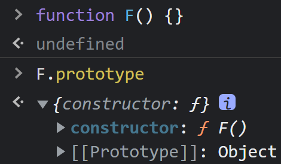
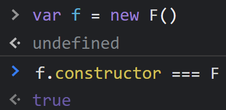
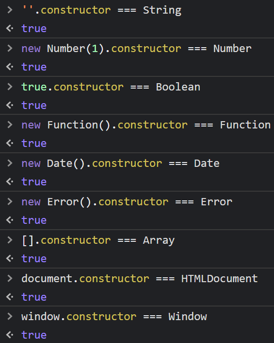
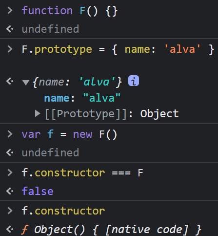

# 拓展

## 清空数组

1. arr.length = 0
2. arr = []
3. arr.splice(0, arr.length)

建议第二种，因为 `arr` 被重新赋值后，如果之前的数组没有被引用，则会被 `JavaScript` 垃圾回收机制回收。

## forin 和 forof

- `for in` 可遍历对象和数组
- `for of` 只能遍历数组

::: details 实践示例

```js
const arr = [
  {
    id: 1,
    name: 'alva',
  },
  {
    id: 2,
    name: 'axel',
  },
  {
    id: 3,
    name: 'alex',
  },
]

const obj = {
  id: 1,
  name: 'alva',
}

for (const item of arr) console.log(/for of/, item)
// /for of/ { id: 1, name: 'alva' }
// /for of/ { id: 2, name: 'axel' }
// /for of/ { id: 3, name: 'alex' }

for (const [key, value] of Object.entries(obj))
  console.log(/for in Object.entries(obj)/, key, value)
// /for in Object.entries(obj)/ id 1
// /for in Object.entries(obj)/ name alva

for (const key in arr) {
  if (Object.hasOwnProperty.call(arr, key)) {
    const element = arr[key]
    console.log(/for in arr/, key, element)
    // /for in arr/ 0 { id: 1, name: 'alva' }
    // /for in arr/ 1 { id: 2, name: 'axel' }
    // /for in arr/ 2 { id: 3, name: 'alex' }
  }
}

for (const key in obj) {
  if (Object.hasOwnProperty.call(obj, key)) {
    const element = obj[key]
    console.log(/for in obj/, key, element)
    // /for in obj/ id 1
    // /for in obj/ name alva
  }
}
```

:::

## forEach

`forEach` 原则上是不能修改原数组的，但是因为 `JavaScript` 本身的原因。如果数组的某一项是引用类型， `forEach` 是可以修改原数组的

```js
const arr = [
  1,
  'mike',
  {
    name: 'jack',
  },
]

arr.forEach(item => {
  item.name = 'alva'
})

console.log(arr) // [1, 'mike', { name: 'alva' }]
```

## 判断对象是否有某个属性

### hasOwnProperty(实例属性)

1. 返回一个布尔值，指示对象自身属性是否有指定的属性
2. 原型链上的不会被访问到，和 in 不同，会忽略到从原型链上继承到的属性
3. 即使属性的值是 `null`，`undefined`，只要属性存在，`hasOwnProperty` 依旧会返回 `true`
4. 注意：这个方法没有被保护，也就是说方法可以自定定义一个这样的方法，来让他的返回值永远是 `true` 或者 `false`

**usage**:

```js
object.hasOwnProperty(key: string)
// or
Object.hasOwnProperty.call(object: object, key: string)
```

### in 方法(实例属性，继承属性)

1. 如果指定的属性在指定的对象或其原型链中，则 `in` 运算符返回 `true`
2. 使用 `delete` 删除的属性返回 `false`
3. 值为 `undefined` 的属性是可以的

**usage**:

```js
!!('key' in object)
```

### Reflect.has()

1. 和 in 方法完全一样,但是第一个参数不是对象会报错
2. 这个方法更加形象
3. 原型链上的方法同样可以会返回 true

**usage**:

```js
Reflect.has(object, 'key')
// or
Reflect.ownKeys(object).includes('key')
```

## 数据类型判断

### typeof

typeof 是一个操作符，其右侧跟一个一元表达式，并返回这个表达式的数据类型。返回的结果用该类型的字符串(全小写字母)形式表示，包括以下 7 种：number、boolean、symbol、string、object、undefined、function 等。

```jsx
typeof '' // string 有效
typeof 1 // number 有效
typeof Symbol() // symbol 有效
typeof true // boolean 有效
typeof undefined // undefined 有效
typeof null // object 无效
typeof [] // object 无效
typeof new Function() // function 有效
typeof new Date() // object 无效
typeof new RegExp() // object 无效
```

有些时候，typeof 操作符会返回一些令人迷惑但技术上却正确的值：

- 对于基本类型，除 null 以外，均可以返回正确的结果。
- 对于引用类型，除 function 以外，一律返回 object 类型。
- 对于 null ，返回 object 类型。
- 对于 function 返回 function 类型。

其中，null 有属于自己的数据类型 Null ， 引用类型中的 数组、日期、正则 也都有属于自己的具体类型，而 typeof 对于这些类型的处理，只返回了处于其原型链最顶端的 Object 类型，没有错，但不是我们想要的结果。

### instanceof

instanceof 是用来判断 A 是否为 B 的实例，表达式为：A instanceof B，如果 A 是 B 的实例，则返回 true，否则返回 false。 在这里需要特别注意的是：instanceof 检测的是原型，我们用一段伪代码来模拟其内部执行过程：

```jsx
const instanceof = (A,B) => {
  const L = A.__proto__
  const R = B.prototype

  if (L === R) {
    // A的内部属性 __proto__ 指向 B 的原型对象
    return true
  }
  return false
}
```

因此，instanceof 不能检测基本数据类型，并且检测 null ，undefined 时会报错，对于引用类型的检测是没有问题的。

### constructor

当一个函数 F 被定义时，JS 引擎会为 F 添加 prototype 原型，然后再在 prototype 上添加一个 constructor 属性，并让其指向 F 的引用。如下所示：



当执行 var f = new F() 时，F 被当成了构造函数，f 是 F 的实例对象，此时 F 原型上的 constructor 传递到了 f 上，因此 f.constructor == F



可以看出，F 利用原型对象上的 constructor 引用了自身，当 F 作为构造函数来创建对象时，原型上的 constructor 就被遗传到了新创建的对象上， 从原型链角度讲，构造函数 F 就是新对象的类型。这样做的意义是，让新对象在诞生以后，就具有可追溯的数据类型。

同样，JavaScript 中的内置对象在内部构建时也是这样做的：



**细节问题**

- null 和 undefined 是无效的对象，因此是不会有 constructor 存在的，这两种类型的数据需要通过其他方式来判断。

- 函数的 constructor 是不稳定的，这个主要体现在自定义对象上，当开发者重写 prototype 后，原有的 constructor 引用会丢失，constructor 会默认为 Object。



为什么变成了 Object ?

因为 prototype 被重新赋值的是一个 { }， { } 是 new Object() 的字面量，因此 new Object() 会将 Object 原型上的 constructor 传递给 { }，也就是 Object 本身。

因此，为了规范开发，在重写对象原型时一般都需要重新给 constructor 赋值，以保证对象实例的类型不被篡改。

### toString

toString() 是 Object 的原型方法，调用该方法，默认返回当前对象的 [[Class]] 。这是一个内部属性，其格式为 [object Xxx] ，其中 Xxx 就是对象的类型。

对于 Object 对象，直接调用 toString() 就能返回 [object Object] 。而对于其他对象，则需要通过 call / apply 来调用才能返回正确的类型信息。

```jsx
Object.prototype.toString.call('') // [object String]
Object.prototype.toString.call(1) // [object Number]
Object.prototype.toString.call(true) // [object Boolean]
Object.prototype.toString.call(Symbol()) // [object Symbol]
Object.prototype.toString.call(undefined) // [object Undefined]
Object.prototype.toString.call(null) // [object Null]
Object.prototype.toString.call(new Function()) // [object Function]
Object.prototype.toString.call(new Date()) // [object Date]
Object.prototype.toString.call([]) // [object Array]
Object.prototype.toString.call(new RegExp()) // [object RegExp]
Object.prototype.toString.call(new Error()) // [object Error]
Object.prototype.toString.call(document) // [object HTMLDocument]
Object.prototype.toString.call(window) // [object Window]
```

### 数据类型判断的工具类

```js
function getVariableType(obj) {
  return Object.prototype.toString.call(obj).slice(8, -1).toLowerCase()
}
```

```js
function getVariableType(obj) {
  return Object.prototype.toString.call(obj).match(/\[object (.*)\]/)[1]
}
```

```js
function isType(type) {
  return obj => Object.prototype.toString.call(obj) === `[object ${type}]`
}

isType('Array')([1, 2, 3])
```

### Reference

- [判断 JS 数据类型的四种方法](https://www.cnblogs.com/onepixel/p/5126046.html)

## 冻结对象

### Object.freeze()

可以冻结一个对象，冻结指的是不能向这个对象添加新的属性，不能修改其已有属性的值，不能删除已有属性，以及不能修改该对象已有属性的可枚举性、可配置性、可写性。该方法返回被冻结的对象。

### Object.freeze() 存在的意义

如果你有一个巨大的数组或 `Object` ，并且确信数据不会修改，使用 `Object.freeze()` 可以让性能大幅提升。在我的实际开发中，这种提升大约有 5~10 倍，倍数随着数据量递增,对于纯展示的大数据，都可以使用 `Object.freeze()` 提升性能。

## Window.open() <Badge type="tip" text="mdn" />

`Window` 接口的 `open()` 方法，是用指定的名称将指定的资源加载到浏览器上下文（窗口 `window` ，内嵌框架 `iframe` 或者标签 `tab` ）。如果没有指定名称，则一个新的窗口会被打开并且指定的资源会被加载进这个窗口的浏览器上下文中。

::: tip 语法

**strUrl**: 要在新打开的窗口中加载的 URL。

**strWindowName**: 新窗口的名称(并不是新窗口的标题,相当于 `<a>` / `<form>` 的 `target`)。

**strWindowFeatures**: 一个可选参数，列出新窗口的特征 (大小，位置，滚动条等) 作为一个 `DOMString`。
:::

<!-- [git](../git/basic#revert) -->

```js
let windowObjectReference = window.open(strUrl, strWindowName, [
  strWindowFeatures,
])

// example
window.open(
  'https://www.google.com',
  'MY_GOOGLE',
  'top=150,left=150,width=300,height=150,scrollbars=no,menubar=no,status=no'
)
```

### demo

<br>

<DemoContainer>
  <p class="demo-source-link">
    <a
      href="https://github.com/Carina957/vitepress-blog/blob/main/docs/guide/javascript/components/window-open-demo.vue"
      target="_blank"
    >source</a>
  </p>

  <Demo />
</DemoContainer>

<script setup lang="ts">
import Demo from './components/window-open-demo.vue'
import DemoContainer from '../../.vitepress/theme/components/DemoContainer.vue'
</script>

### Reference

- [Window.open() | MDN](https://developer.mozilla.org/zh-CN/docs/Web/API/Window/open)
