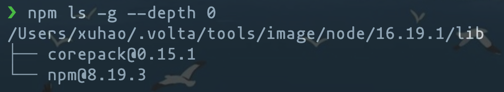
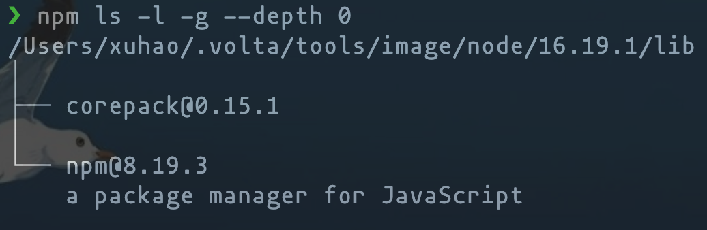

# Node

## ni

[**ni**](https://github.com/antfu/ni) - use the right package manager.

```sh
$ npm i -g @antfu/ni
```

[npm](https://docs.npmjs.com/cli/v6/commands/npm) · [yarn](https://yarnpkg.com) · [pnpm](https://pnpm.js.org/en/) · [bun](https://bun.sh/)

### `ni` - install

```sh
ni

# npm install
# yarn install
# pnpm install
# bun install

nun @types/node

# npm uninstall @types/node
# yarn remove @types/node
# pnpm remove @types/node
```

::: details others

```sh
ni vite

# npm install vite
# yarn add vite
# pnpm add vite

ni @types/node -D

# npm i -D @types/node
# yarn add -D @types/node
# pnpm add -D @types/node

ni -g eslint

# npm install -g eslint
# yarn add global eslint
# pnpm add eslint -g

ni --frozen
# npm ci
# yarn install --frozen-lockfile (Yarn 1)
# yarn install --immutable (Yarn Berry)
# pnpm install --frozen-lockfile
# bun install --no-save
```

:::

### `nr` - run

```sh
nr dev --port=3000

# npm run dev --port=3000
# yarn run dev --port=3000
# pnpm run dev --port=3000
# bun run dev --port=3000

nr
# interactively select the script to run

nr -
# rerun the last command
```

### Config

```ini
; ~/.nirc
; fallback when no lock found
defaultAgent=npm # default "prompt"
; for global installs
globalAgent=npm
```

```bash
# ~/.bashrc
# custom configuration file path
export NI_CONFIG_FILE="$HOME/.config/ni/nirc"
```

<br>

## volta

::: code-group

```sh [curl]
$ curl https://get.volta.sh | bash
```

```sh [brew]
$ brew install volta
```

:::

然后，添加 `volta` 到环境变量：

```sh
source .bash_profile
```

之后，你就可以正常使用 `volta`

::: details 当你在终端运行 `volta` or `volta -h`:

```sh
$ volta
```

```text
Volta 1.1.1
The JavaScript Launcher ⚡

    To install a tool in your toolchain, use `volta install`.
    To pin your project's runtime or package manager, use `volta pin`.

USAGE:
    volta [FLAGS] [SUBCOMMAND]

FLAGS:
        --verbose    Enables verbose diagnostics
        --quiet      Prevents unnecessary output
    -v, --version    Prints the current version of Volta
    -h, --help       Prints help information

SUBCOMMANDS:
    fetch          Fetches a tool to the local machine
    install        Installs a tool in your toolchain
    uninstall      Uninstalls a tool from your toolchain
    pin            Pins your project's runtime or package manager
    list           Displays the current toolchain
    completions    Generates Volta completions
    which          Locates the actual binary that will be called by Volta
    setup          Enables Volta for the current user / shell
    run            Run a command with custom Node, npm, pnpm, and/or Yarn versions
```

:::

::: details 当你在终端运行 `volta pin node@16`:

```text
success: pinned node@16.19.1 (with npm@8.19.3) in package.json
```

此时，你的 `package.json` 文件里就会多出一行配置：

```json
"volta": {
  "node": "16.19.1"
}
```

:::

::: details 此外，你还可以运行 `volta ls` 查看 `volta` 已经安装的模块：

```text
⚡️ Currently active tools:

    Node: v16.19.1 (current @ /Users/xuhao/Downloads/front-end/vitepress/vitepress-blog/
    package.json)
    Yarn: v4.0.0-rc.39 (default)
    Tool binaries available:
        nrm (default)
        pnpm, pnpx (default)
        rimraf (current @ /Users/xuhao/Downloads/front-end/vitepress/vitepress-blog/
    package.json)
        yrm (default)

See options for more detailed reports by running `volta list --help`.
```

:::

## npm

```sh
# 查看全局安装的模块
$ npm ls -g --depth 0

# 查看全局安装的模块的详细信息(name, description, version number, github address, official website.)
$ npm ls -l -g --depth 0

# 安装到 `devDependencies` 中
$ npm i dayjs -S

# 安装到 `dependencies` 中
$ npm i dayjs -D

# 查看 `npm` 配置
$ npm config list

# 查看 `npm` 全部配置
$ npm config ls -l
```





### --legacy-peer-deps

npm 的 `--legacy-peer-deps` 命令是用于在安装依赖包时启用旧版对等依赖解析算法的选项。

在 npm 7 中，对等依赖解析算法发生了变化，它会忽略与实际依赖不兼容的依赖项。这可能会导致安装失败或不兼容的依赖项被安装。为了解决这个问题，`--legacy-peer-deps` 选项被引入，它允许使用旧版对等依赖解析算法，以避免安装中断或不兼容的依赖项。

可以通过以下命令启用 `--legacy-peer-deps` 选项：

```sh
$ npm install --legacy-peer-deps
```

除此之外，还可以在 npm 配置文件中设置该选项，以使其在所有安装命令中自动启用：

```sh
$ npm config set legacy-peer-deps true
```

如果您想 `--legacy-peer-deps` 默认为所有 npm 安装设置标志，则可以考虑更新 `.npmrc` 文件。

```text
legacy-peer-deps=true
```

需要注意的是，`--legacy-peer-deps` 它会告诉 npm 完全忽略对等依赖性。从长远来看，这会增加你的依赖解析。

### --force

`--force` 命令是指忽略所有警告强制安装包，这样做可能会造成不可预测的后果，往往用于解决某些包在安装时出现的问题。

通常，我们希望使用该 `--force` 标志，因为这会告诉 npm 在发现冲突的依赖项时尝试设置不同的对等依赖项。

使用 force 仍然不是那么好，因为它会在你的 `node_modules` 文件夹中占用更多的磁盘空间——例如获取不同的版本并将它们存储在本地！
