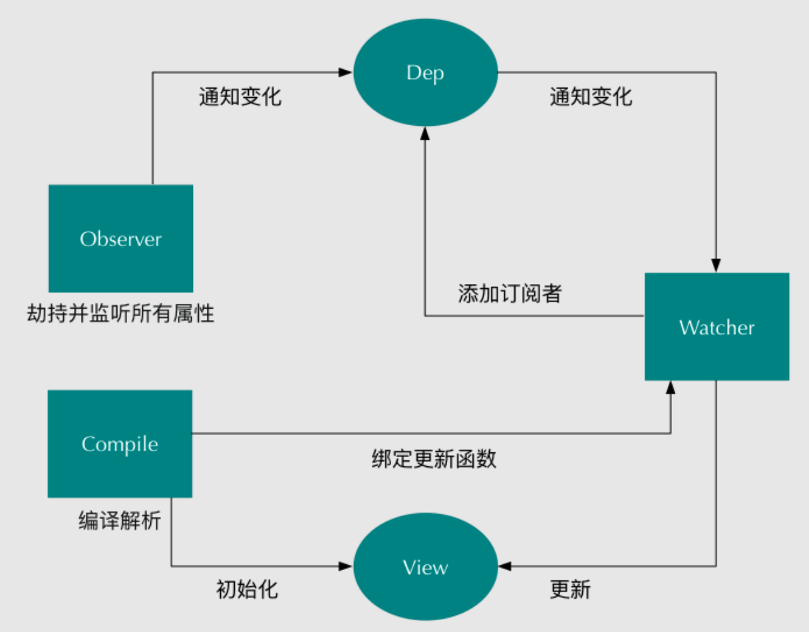

# 基础

## 对 Vue 渐进式框架的理解

- 渐进式的含义: 主张最少, 没有多做职责之外的事。
- Vue 有些方面是不如 React，不如 Angular。但它是渐进的，没有强主张，你可以在原有系统的上面，把一两个组件改用它实现，当 jQuery 用。
- 也可以整个用它全家桶开发，当 Angular 用；还可以用它的视图，搭配你自己设计的整个下层用。
- 你可以在底层数据逻辑的地方用 OO 和设计模式的那套理念，也可以函数式，都可以，它只是个轻量视图而已，只做了自己该做的事，没有做不该做的事，仅此而已。

## Vue 的双向绑定的原理

- 数据双向绑定是通过数据劫持结合发布者-订阅者模式的方式来实现的。
- 具体实现流程:
  - 实现一个监听器 `Observer` ，用来劫持并监听所有属性，如果有变动的，就通知订阅者
  - 实现一个订阅者 `Watcher` ，可以收到属性的变化通知并执行相应的函数，从而更新视图
  - 实现一个解析器 `Compile` ，可以扫描和解析每个节点的相关指令，并根据初始化模板数据以及初始化相应的订阅器



## Key 的作用

- key 的作用主要是为了高效的更新虚拟 DOM。另外 vue 中在使用相同标签 名元素的过渡切换时，也会使用到 key 属性，其目的也是为了让 vue 可以 区分它们。否则 vue 只会替换其内部属性而不会触发过渡效果
- key 不能用 index 代替，index 在同一个页面会有重复的情况，违背了高效 渲染的初衷。

## Vue 组件中 data 必须是函数

- 在 `new Vue()` 中，data 是可以作为一个对象进行操作的，然而在 component 中，data 只能以函数的形式存在，不能直接将对象赋值给它。
- 当 data 选项是一个函数的时候，每个实例可以维护一份被返回对象的独立的拷贝，这样各个实例中的 data 不会相互影响，是独立的。

## mitt

Vue3 的全局事件总线库

### 引入

```js
import mitt from 'mitt'

const emitter = mitt()

export default emitter
```

### 使用

```vue
<script setup lang="ts">
import emitter from './eventBus'
import { message } from 'element-plus'

const handleMessage = msg => message(msg)

emitter.on('handleMessage', handleMessage) // 监听事件
emitter.off('handleMessage', handleMessage) // 取消监听事件
emitter.emit('handleMessage', '开始监听') // 触发事件
emitter.all.clear() // 取消监听所有事件
</script>
```

## Provide & Inject

`provide` 和 `inject` 的绑定并不是响应式的，这是刻意为之的，然而，如果你传入了一个可监听的对象，那么其对象的属性还是可响应的。

### 替代 Vuex

只需要把整个 `app.vue` 实例通过 `provide` 对外提供。

```vue
<template>
  <router-view />
</template>

<script>
import request from '@/utils/request'

export default {
  provide () {
    return {
      app: this,
    }
  },
  data () {
    return {
      userInfo: null,
    }
  },
  mounted () {
    this.getUserInfo()
  },
  methods: {
    async getUserInfo () {
      const { userInfo } = await request('/user/info')

      this.userInfo = userInfo
    },
  },
}
</script>
```

```vue
<template>
  <div>
    <span @click="updateUserInfo">{{ app.userInfo }}</span>
  </div>
</template>

<script>
import request from '@/utils/request'

export default {
  inject: ['app'],
  methods: {
    async updateUserInfo () {
      const { code } = await request('user/update')

      (code === 1) && this.app.getUserInfo()
    }
  }
}
</script>
```
