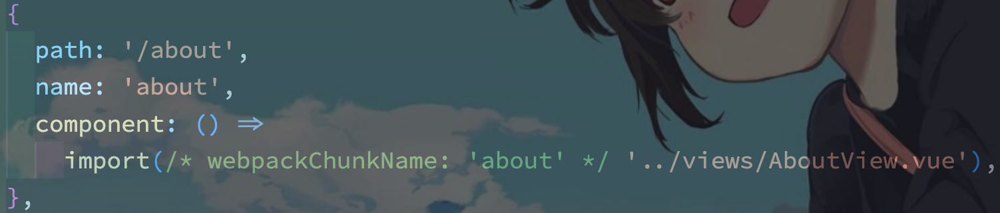

# 基础

## webpackChunkName

`webpackChunkName` 是为预加载的文件取别名，作用就是 `webpack` 在打包的时候，对异步引入的库代码（ eg: `lodash` ）进行代码分割时（需要配置 `webpack` 的 `SplitChunkPlugin` 插件），为分割后的代码块取得名字

`import` 异步加载的写法实现页面模块 `lazy loading` 懒加载（ `Vue` 中的路由异步加载）：

`Vue` 中运用 `import` 的懒加载语句以及 `webpack` 的魔法注释，在项目进行 `webpack` 打包的时候，对不同模块进行代码分割，在首屏加载时，用到哪个模块再加载哪个模块，实现懒加载进行页面的优化

