# 骑行

## 日常骑行

<h2 align="center">1</h2>

某天好看的落日，留下了一张照片。

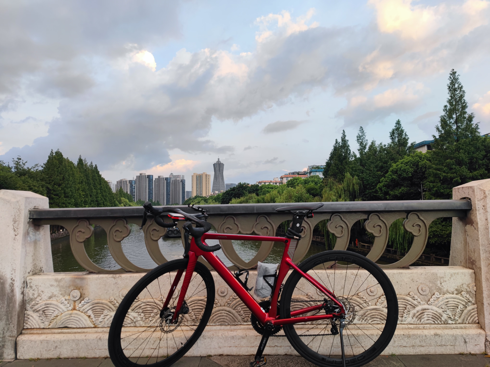

## 杨公堤骑行

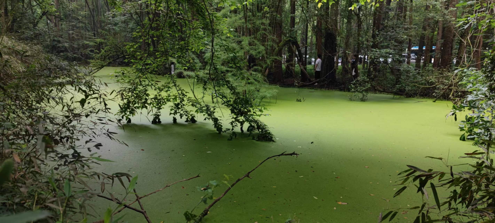
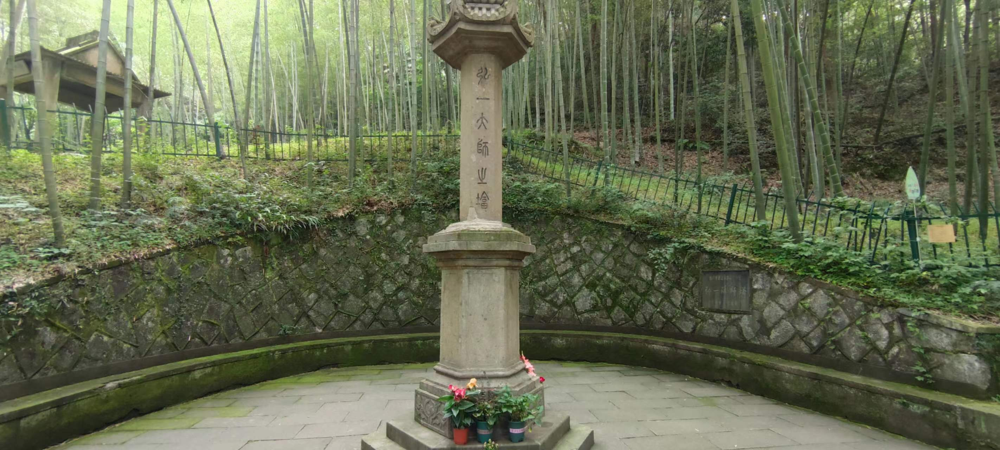
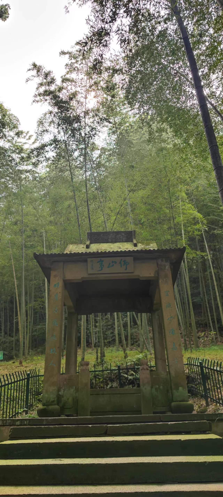
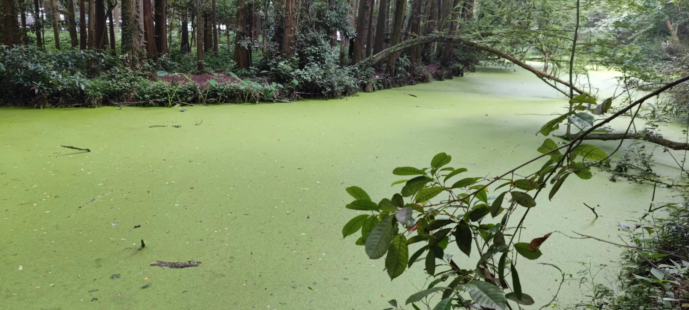
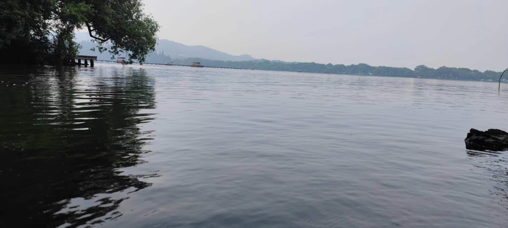
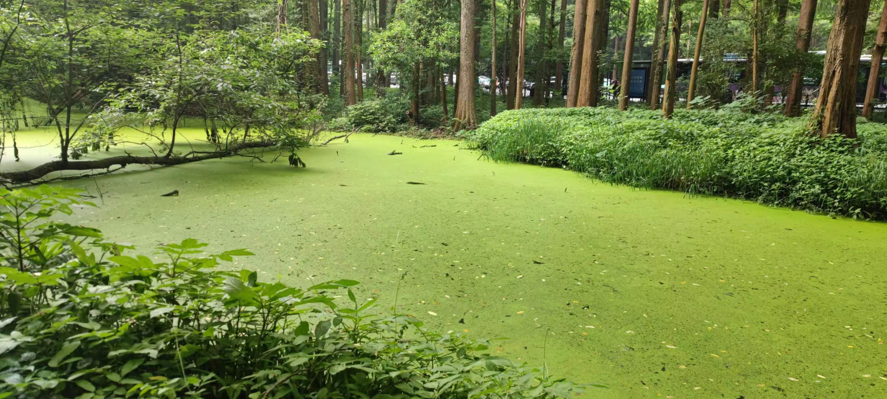

## 南苕溪骑行

<h2 align="center">1</h2>

总公里数！第一次骑行这么长的距离...

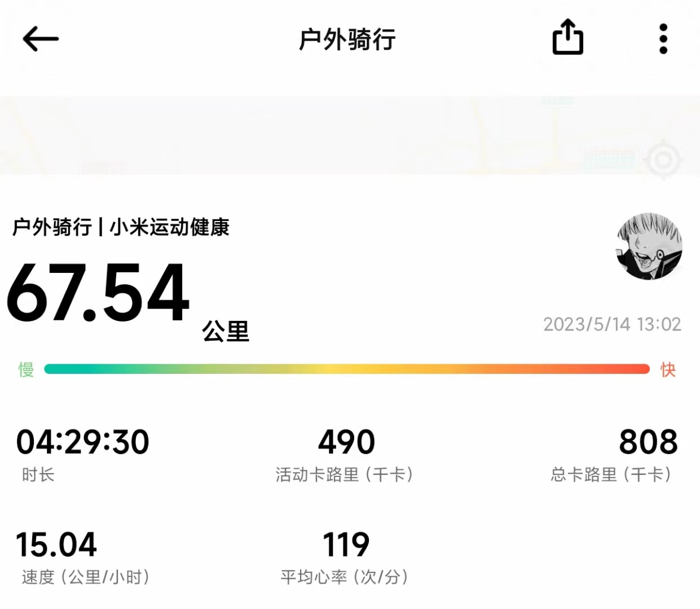

<h2 align="center">2</h2>

路上遇见废弃的火车轨道，让朋友拍的照片打卡。

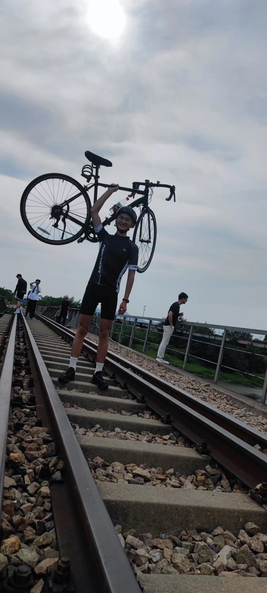

## 青山湖骑行

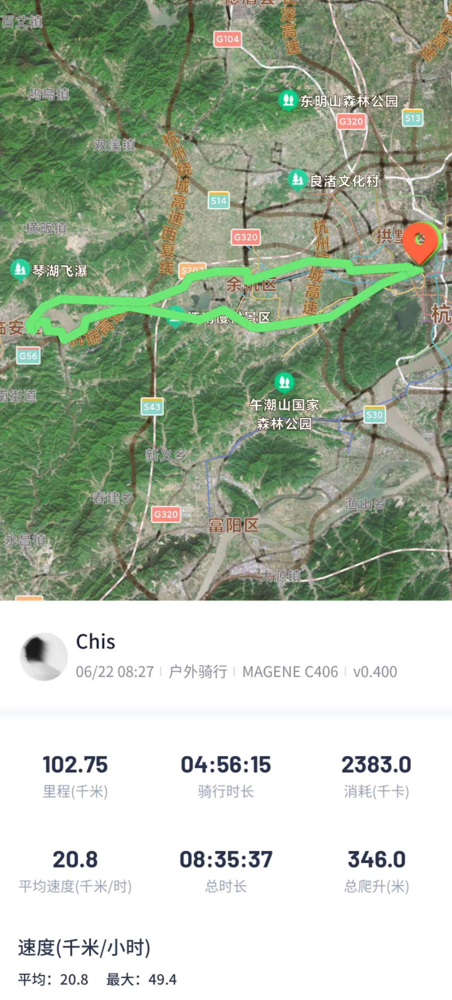
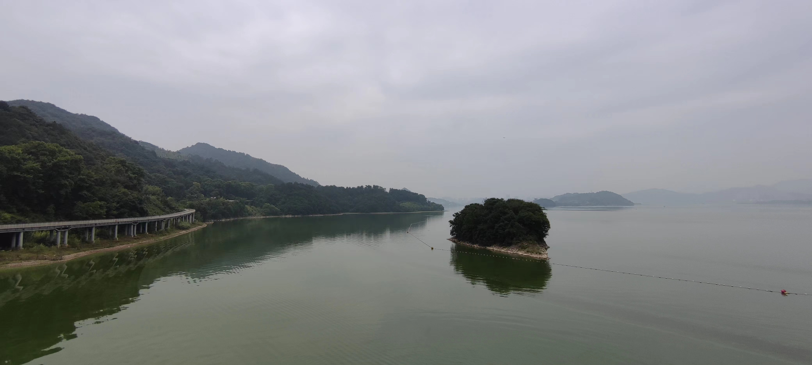
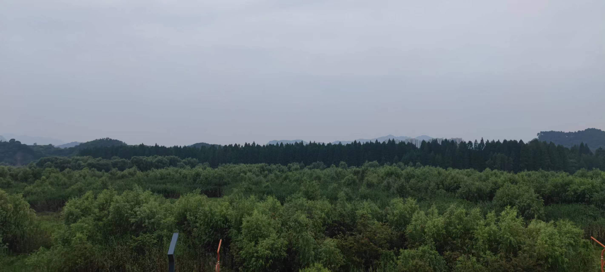
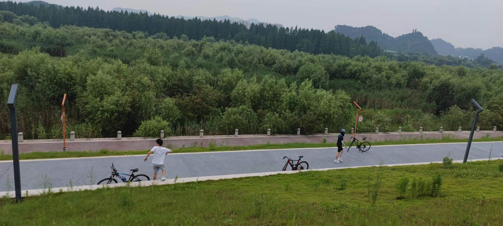

## 腐败夜宵骑

> location: 华瑞·湘湖美地[杭州萧山区]

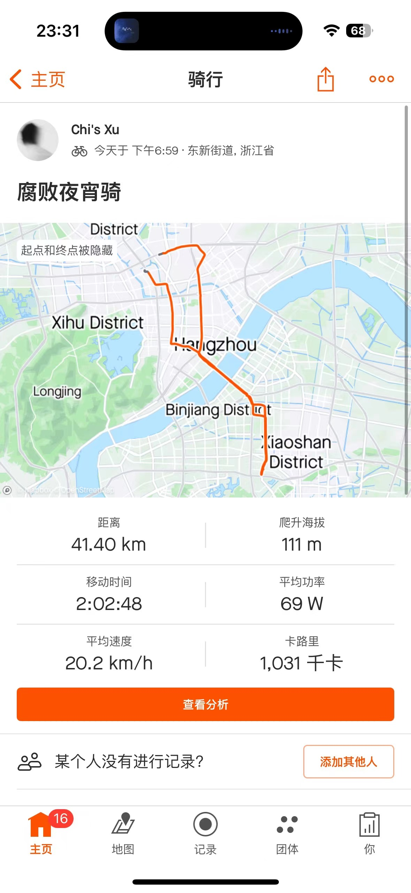

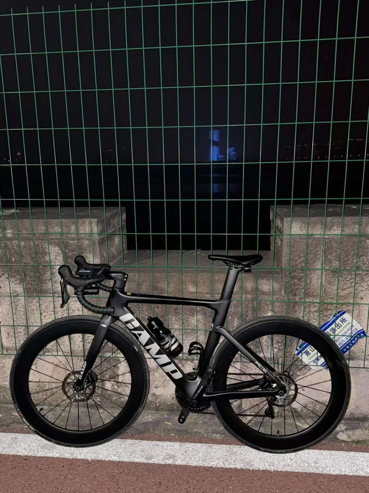
